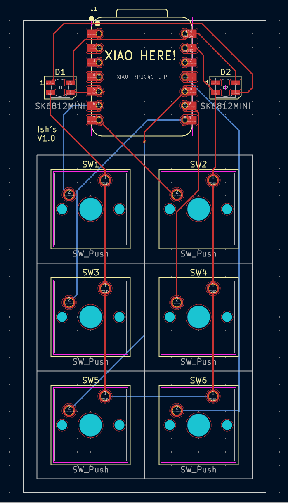
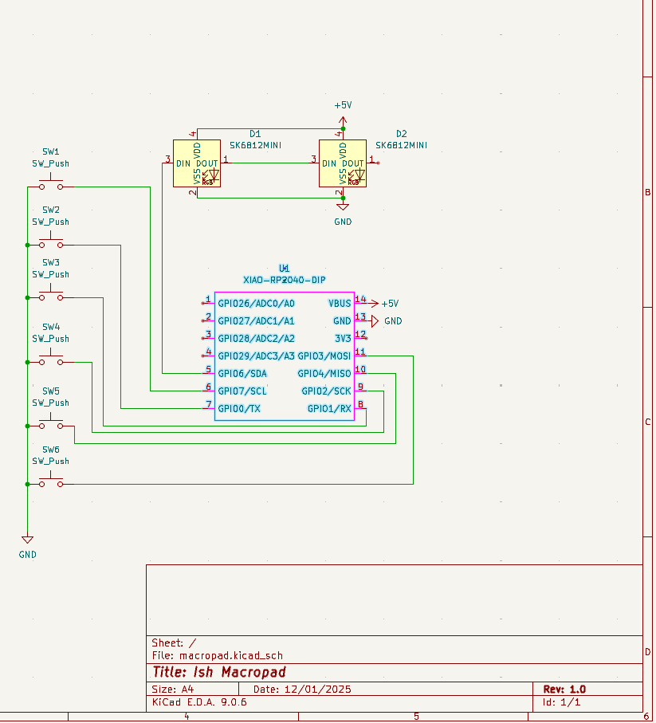

# macropad

## Macropad with 6 Buttons
A compact 6-button macropad designed for Funtion keys. Each button can be programmed with custom macros, shortcuts, or media controls.

## BOM (Bill of Materials)
- 2 SK6812 MINI-E LED
- 6 Blank DSA black keycaps
- 4 M3x16mm screws
- 1 Seeed XIAO RP2040
- 6 MX-Style switches

## Assembly Reference

### PCB Design

### Schematic
